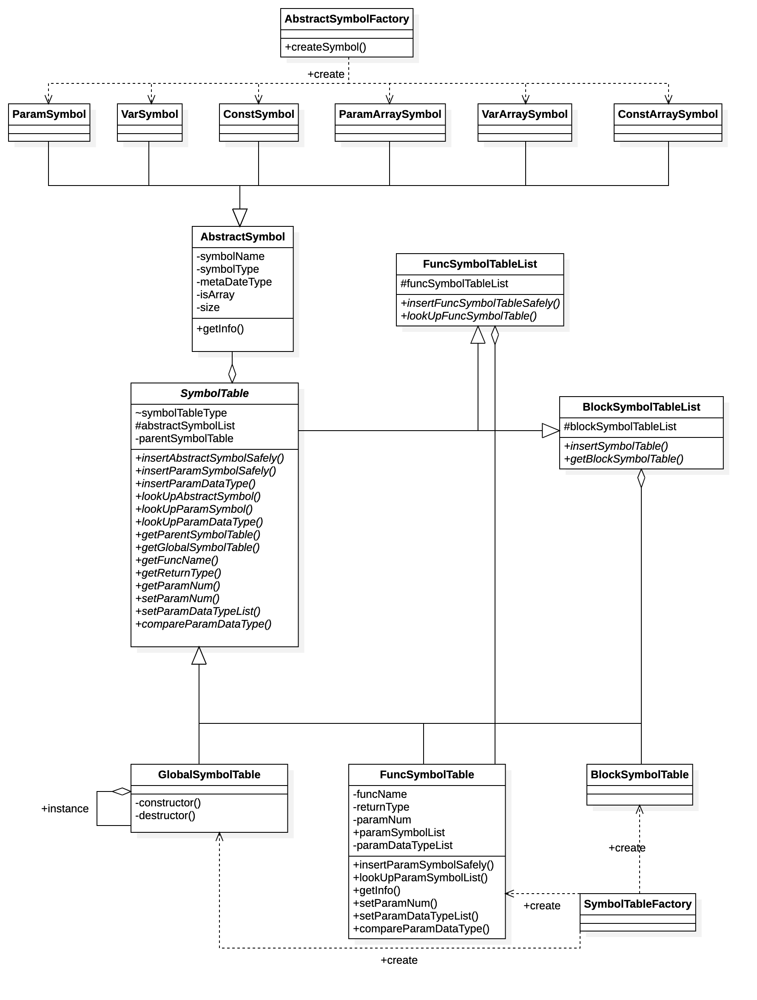

# 编译原理研讨课实验PR002实验报告

[author]: 高梓源 官奕琳 [Stu.Num]: 2019K8009929026 2019K8009907026

[TOC]

## 任务说明

本次实验首先需要完成SysY语言符号表的设计和操作处理。

利用符号表在PR001的基础上实现对SysY语言进行语义分析和类型检查，对于语义错误能进行相应的处理，即对于符合语义规范的.cact文件，编译器返回0，对于有语义错误的.cact文件，编译器返回非0值。

## 成员组成

- 高梓源，2019K8009929026
- 官奕琳，2019K8009907026
## 实验设计

### 设计思路

#### 符号表设计

参考[Geeks](https://www.geeksforgeeks.org/symbol-table-compiler/)所述，符号表应包含：

- 变量，常量名
- 过程和函数名
- 字面量和字符串
- 中间变量名
- 源语言中标签

参考[SIT](https://www.sitsitamarhi.ac.in/wp-content/uploads/2020/05/file_5eaf089be4138.pdf)中所述，符号表元数据应该存储：

- 数据类型
- 作用域
- 相关信息
- 属性

上述描述只是有了初步的概念，我们结合SysY的应用实例思考符号表如何组织。

- 首先站在顶层，需要有一个**全局符号表`globalSymbolTable`**，存储**全局变量**和**函数符号表列表**
- 而后函数符号表中面向函数内部符号信息，需要存储**参数符号、指代符号、块符号表列表**
- 而语句中的块结构需要存储内部定义的**局部变量符号**与**下一层的块结构列表**

在C语言中通常组织符号表有以下数据结构：

- 普通的数组
- 链表
- 哈希表
- 二叉搜索树

都是只针对元符号（指代符号）存储查找的过程，可以将各种符号列成大表，丰富记录信息，各符号表各取所需。但是C++的面向对象特性机遇了符号表更多可能的设计。

首先明确一下上面可能已经用到的相关名词：

- 指代符号：使用Ident进行匹配的，用以指代值的抽象符号
- 块结构：函数内部语句中使用成对大括号括起的若干条语句，对应词法中block
- 声明：只声明类型，不定义实现，SysY中只适用于函数声明
- 定义：定义指代符号的值，定义函数的实现。SysY specification中指出“*未显式初始化的整型和浮点型变量/常量/数组被默认初始化为0*”，因此所有变量的声明都可以直接视为定义其值为0。

接下来根据UML类图详细叙述设计：



##### 指代符号

首先从最基本的元素开始，作为指代值的抽象符号，根据指代内容可以划分为6种：参数符号、变量符号、常量符号、参数数组、变量数组、常量数组。

此处我们的设计是提取其共性组成父类`AbstractSymbol`，共性为符号名称、符号类型、元数据类型、是否是数组、大小，符号类型和是否是数组决定了上述6种指代符号中采用哪种进行实例化，为实例化的方便，我们采用简单工厂模式（兼顾了面向对象特性和时间复杂度），定义`AbstractSymbolFactory`及其静态方法`createSymbol`。此外，确定一个指代符号还依赖的信息是元数据类型和大小，前者为`int, bool`等SysY基本数据类型，后者保存数组大小。

采用一个复杂的例子：`int array[10];`，该语句定义了一个整形数组变量，大小为10，要想唯一确定这个符号必须存储：`数组名`、`变量`、`整型`、`数组`、`大小为10`这五条信息，虽然按照SysY语言规范，查找时只需要数组名这一条信息，但其他信息在进行类型判断时尤为重要。

(C++)面向对象的另一个核心要素在于访问控制，我们这里默认所有符号在定义的时候就已经确定类型，之后在相同作用域内不可以二次定义。因此设置`AbstractSymbol`或其子类信息的唯一手段是通过构造函数，此处只提供`const`类型（若对类成员有修改在编译阶段会报错）的`get`方法。

##### 符号表列表

从UML图及前面的叙述中可以了解到准备了三类符号表：全局符号表、函数符号表、块结构符号表，全局符号表唯一，后两者都不唯一，他们在parent符号表中需要以列表的形式出现，此外在每个符号表中都需要包含指代符号组成的列表，函数符号表中还需要参数指代符号的列表。函数符号表还做了一个更加便捷的功能：为方便调用函数时判断调用是否正确，只对参数类型做了一个列表，调用时直接根据下标索引参数类型即可。因此共五种列表结构。

为了加速访问，考虑五种列表结构适合的数据结构。注意到在语法分析扫描的过程中，往往是利用符号名进行匹配和查找，因此自然想到使用hash table。那么拥有唯一名称可以使用hash table的列表结构是`AbstractSymbolList, ParamSymbolList, FuncSymbolTableList`，剩下的块结构和参数类型列表无法使用此结构表达，而且事实上并不需要对他们进行名称查找的操作。C++中Hash table为STL库`unordered_map`，剩下的使用`vector`即可。根据需求，符号表列表基本都提供插入和查找操作。

##### 符号表

符号表设计依然采用面向父类，这里有过权衡，因为三种符号表事实上共性不多，但因为有一个需求是必须在符号表中提供parent符号表指针，因此采用统一的父类，否则在表示该符号表指针时还需要额外的信息表明它的类型；此外关于子类中并不存在的功能若在面向父类时被调用，在C++中也能得到较为合理的返回措施或编译报错。

因此采用父类`SymbolTable`，三个子类`GlobalSymbolTable, FuncSymbolTable, BlockSymbolTable`。此外重要的是本次运用OOP采用了一个突破，传统上而言，*组合优于继承*，但是C++面向对象具有多继承的特性，这赋予了OOP一些不同的开拓思路。因为如果是组合关系，使用者需要完全接受组合件函数的所有功能，而采用多继承，而不是java中的单继承多接口，C++中子类可以在多个父类中各取所长，而且可以自由重写组件的函数功能，自由度更高。基于这样的考虑，`SymbolTable`继承了`FuncSymbolTableList, BlockSymbolTableList`，而指代符号的两个list(`AbstractSymbolList, ParamSymbolList`)由`SymbolTable`本身来实现即可，因为`ParamSymbolList`只在`FuncSymbolTable`中可能需要重写，因此在其父类`SymbolTable`中采用组合关系页未尝不可。`GlobalSymbolTable`需要保证全局只有一个，采用单例模式。

为了加速访问，和重写的需求，将各个`List`设置为protected属性。

函数接口主要提供五种：`insert, lookUp, get, set, compare`，父类中皆为虚函数(`virtual`)，但有些进行实现。面向对象中值得利用的一个特性为代码重用，就体现在此处，若无修改必要，直接使用父类模版。但是，若有些函数接口是某个子类特有的，在父类中进行直接返回式实现，在子类中`override`，函数所需要的成员变量只需要定义在子类中，若某个函数需要每个子类不同实现，则直接在最后加`const = 0`，每个子类`override`，否则子类未能实现则编译器报错（但本次试验没有这类情况）。

#### SysY词法描述更新

在上次实验，我们将一部分存在左递归的文法进行左递归消除，本意是辅助SysY更快速的进行分析。但这次实验中，语法分析阶段更常见的情形是二元关系运算，为更快速方便的进行语义分析，将左递归还原成二元关系，按照递归方式逐级判断，虽然本质上和扫描判断相近，但是简化为二元关系并恰当运用继承属性、综合属性能够有更多的实现，更加符合编译中三地址、二地址转换的一般方法。

此外，为全面的语法分析，对于分支产生式都单独添加子标签，便于寻访。对于需要用到符号表相关量作为继承、综合属性的产生式也增加`locals`变量定义。

### 实验实现

#### 枚举类型

首先先定义了几个枚举class，用以表述类型更加方便

- `SymbolTable`: `PARAM, VAR, CONST`
- `TableType`: `GLOBAL, FUNC, BLOCK`
- `MetaDataType`: `VOID, BOOL, INT, FLOAT, DOUBLE`

#### 指代符号

##### 函数接口

|函数名|类|参数|返回类型|说明|
|:-:|:-:|:-:|:-:|:-:|
|`getSymbolName`|`AbstractSymbol`|`void`|`string`|返回符号名称|
|`getSymbolType`|`AbstractSymbol`|`void`|`SymbolType`|返回符号名称|
|`getMetaDataType`|`AbstractSymbol`|`void`|`MetaDataType`|返回符号名称|
|`getIsArray`|`AbstractSymbol`|`void`|`bool`|返回符号名称|
|`getSize`|`AbstractSymbol`|`void`|`size_t`|返回符号名称|
|`setAttributes`|`AbstractSymbol`|`string, SymbolType, MetaDataType, bool, size_t`|`bool`|设置属性，**子类不应调用父类构造函数**|
|`ParamSymbol`|`ParamSymbol`|`string, SymbolType, MetaDataType, bool, size_t`|`void`|构造函数，直接设置符号信息|
|`VarSymbol`|`VarSymbol`|同上|`void`|构造函数|
|`ConstSymbol`|`ConstSymbol`|同上|`void`|构造函数|
|`ParamArraySymbol`|`ParamArraySymbol`|同上|`void`|构造函数|
|`VarArraySymbol`|`VarArraySymbol`|同上|`void`|构造函数|
|`ConstArraySymbol`|`ConstArraySymbol`|同上|`void`|构造函数|
|`AbstractSymbol`|`AbstractSymbol`|同上|`void`|构造函数|
|`createSymbol`|`SymbolFactory`|同上|`void`|工厂模式，推荐使用|

用基类表述的函数在子类中都可以直接使用，面向父类时采用最下定义。

#### 符号表列表

##### 函数接口

|函数名|类|参数|参数类型|返回类型|说明|
|:-:|:-:|:-:|:-:|:-:|:-:|
|`insertFuncSymbolTableSafely`|`FuncSymbolTableList`|`inFuncSymbolTable`|`SymbolTable *`|`SymbolTable *`|将传入的函数符号表加入列表（查重），若成功返回加入的函数符号表指针|
|`lookUpFuncSymbolTable`|`FuncSymbolTableList`|`inFuncName`|`string`|`SymbolTable *`|根据函数名和返回值新建一个函数符号表加入列表（查重），若成功返回加入的函数符号表指针|
|`insertBlockSymbolTable`|`BlockSymbolTableList`|`inBlockSymbolTable, inParentSymbolTable`|`SymbolTable *`<br>`SymbolTable *`|`SymbolTable *`|将传入的块结构符号表加入列表，填入块符号表的父符号表，若成功返回新加入的符号表指针|
|`getBlockSymbolTable`|`BlockSymbolTableList`|`index`|`int`|`SymbolTable *`|根据下标返回块符号表指针，若输入不合法则报错|

##### 实现细节

**Insert操作**

根据STL接口，`unordered_map`使用`emplace`插入元素而不采用`insert`，避免了临时变量的产生，有效利用了C++ 11的新特性：**`变参模版`**和**`完美转发`**，参数类型更加灵活，且不必进行显示类型变换。

首先进行查重的操作运用C++模版的特性，方便不同形式的列表实现进行查重。

```cpp
template <class T>
bool findDuplicateName(T list, string className, string name) {
    auto searchSymbol = list.find(name);
    if (searchSymbol != list.end()) {
        ERROR_INSERT_DUPLICATED(className, name);
        return true;
    }
    return false;
}
```

若未发现重名，则进行插入操作，事先利用符号工厂创建所需类型的符号：

```cpp
SymbolTable *FuncSymbolTableList::insertFuncSymbolTableSafely(string inFuncName, MetaDataType inReturnType, SymbolTable *inParentSymbolTable) {
    if (findDuplicateName(funcSymbolTableList, "FuncSymbolTableList", inFuncName)){
        return nullptr;
    }
    SymbolTable *insertSymbolTable = new FuncSymbolTable(inFuncName, inReturnType, inParentSymbolTable);
    funcSymbolTableList.emplace(inFuncName, insertSymbolTable);
    return insertSymbolTable;
}
```

**LookUp操作**

对于unordered_map，查找操作时间复杂度极低，因为底层使用hash table实现，先求解hash值之后直接索引到目标即可。同样可以调用STL模版函数`find`，返回类型是迭代器，若指向列表尾部（在外部）则说明查找失败，否则返回对应位置的AbstractSymbol指针。

#### 符号表

##### 函数接口

使用基类`SymbolTable`定义的函数在子类中都可以直接调用，使用子类定义的函数为该子类特有，其余函数不允许调用。

|函数名|类|参数|参数类型|返回类型|说明|
|:-:|:-:|:-:|:-:|:-:|:-:|
|`insertAbstractSymbolSafely`|`SymbolTable`|`inSymbolName, inSymbolType, inMetaDataType,inIsArray, inSize`|`string, SymbolType, MetaDataType, bool, size_t`|`AbstractSymbol *`|利用所给参数带查重地插入指代符号列表，若成功返回指代符号指针|
|`insertAbstractSymbolSafely`|`SymbolTable`|`inAbstractSymbol`|`AbstractSymbol *`|`AbstractSymbol *`|利用所给参数带查重地插入指代符号列表，若成功返回指代符号指针|
|`lookUpAbstractSymbol`|`SymbolTable`|`inSymbolName`|`string`|`AbstractSymbol *`|利用指代符号名称查找之，只在当前作用域内查找|
|`lookUpAbstractSymbolGlobal`|`SymbolTable`|`inSymbolName`|`string`|`AbstractSymbol *`|利用指代符号名称查找之，**注意会逐级向上查找，找到存在对应符号的最下嵌套作用域**|
|`getParentSymbolTable`|`SymbolTable`|`void`|`void`|`SymbolTable *`|找到本符号表的父符号表|
|`getGlobalSymbolTable`|`SymbolTable`|`void`|`SymbolTable *`|本意只是为了全局符号表单例模式提供，但理论而言确实可以被外部和子类访问|
|`setParameterSymbolTable`|`SymbolTable`|`parentSymbolTable`|`SymbolTable *`|`bool`|为了弥补，若此前构造函数未能提供父符号表，则可调用此函数定义|
|`compareAbstractSymbolDataType`|`SymbolTable`|`inSymbolName, inSymbolType, inMetaDataType, inIsArray, inSize`|`string, SymbolType, MetaDataType, bool, size_t`|`bool`|比较变量名的相关属性和传入属性是否相同，确定该变量是否类型和要求完全一致|
|`FuncSymbolTable`|`FuncSymbolTable`|`inFuncName, inReturnType, inParentSymbolTable`|`string, MetaDataType, SymbolType *`|`void`|构造函数|
|`insertParamSymbolSafely`|`FuncSymbolTable`|`inSymbolName, inMetaDataType, inIsArray, inSize`|`string, MetaDataType, bool, size_t`|`AbstractSymbol *`|根据所给参数信息新建参数指代符号，插入参数符号表，若成功，返回参数符号指针|
|`insertParamType`|`FuncSymbolTable`|`inMetaDataType, inIsArray, inSize`|`MetaDataType, bool, size_t`|`bool`|根据所给参数信息新建参数指代符号，加入参数类型列表，成功时返回true|
|`lookUpParamSymbol`|`FuncSymbolTable`|`inSymbolName`|`string`|`AbstractSymbol *`|在参数符号列表中查找指定名称符号，返回符号指针|
|`lookUpParamDataType`|`FuncSymbolTable`|`inSymbolName`|`string`|` tuple <SymbolType, MetaDataType, bool, size_t> `|在参数符号列表查找制定符号名称，返回符号相关属性|
|`getFuncName`|`FuncSymbolTable`|`void`|`void`|`string`|返回函数名|
|`getReturnType`|`FuncSymbolTable`|`void`|`void`|`MetaDataType`|返回函数返回类型|
|`getParamNum`|`FuncSymbolTable`|`void`|`void`|`int`|返回函数参数个数，注意需要先调用计算函数|
|`setFuncName`|`FuncSymbolTable`|`inFuncName`|`string`|`bool`|设置函数名，弥补构造函数缺漏|
|`setReturnType`|`FuncSymbolTable`|`inReturnType`|`MetaDataType`|`bool`|设置函数返回类型|
|`setParamNum`|`FuncSymbolTable`|`void`|`void`|`int`|设置参数个数，调用即可，内部自动计算|
|`setParamDataTypeList`|`FuncSymbolTable`|`void`|`void`|`void`|bool`|设置参数类型列表，调用即可，内部自动计算|
|`compareParamSymbolDataType`|`FuncSymbolTable`|`index, inMetaDataType, inIsArray, inSize`|`int, MetaDataType, bool, size_t`|`bool`|直接比较某位置的参数类型|
|`createSymbolTable`|`SymbolTableFactory`|`inTaleType`|`TableType`|`SymbolTable *`|工厂模式构造符号表类，暂不建议使用|

注意`GlobalSymbolTable`只能使用`getGlobalSymbolTable`的方式获取，可以使用`SymbolTable`和`FuncSymbolTableList`中所有接口，`BlockSymbolTable`可以使用`SymbolTable`和`BlockSymbolTableList`中所有接口，`FuncSymbolTableList`可采用全部接口。

##### 实现细节

注意这里提供了向上反递归查找指代符号的接口`lookUpAbstractSymbolGlobal`，查找顺序是：

1. 当前作用域内`AbstractSymbolList`
2. 若当前为函数符号表，查找`ParamSymbolList`
3. 向上(`paramSymbolTable`)查找

根据SysY specification，变量在不同作用域中可以覆盖，变量可以和函数同名，插入操作只需要搜索当前作用域有无重名变量。

### SysY语义分析

#### CompUnit

```antlr
compUnit
    locals [
        SymbolTable *globalSymbolTable
    ]
    : (decl | funcDef)+ EOF
    ;
```

- 增加了`SymbolTable *globalSymbolTable`属性，因为`CompUnit`为语法分析树的根节点，所以在此添加全局符号表属性

- 进入结点时，即开始语义分析时：

  - 将全局符号表赋值给当前符号表

  - 在全局符号表中插入以下函数符号表：

    | 函数名称     | 返回值类型 |
    | ------------ | ---------- |
    | print_int    | void       |
    | print_float  | void       |
    | print_double | void       |
    | print_bool   | void       |
    | get_int      | int        |
    | get_float    | float      |
    | get_double   | double     |

  - 在每个函数符号表中插入**参数符号表**，并设置参数的数据类型列表，同时记录参数数量

    以`print_int`函数符号表为例：

    ```c++
    funcSymbolTable->insertParamSymbolSafely("", MetaDataType::, false, 0);
    funcSymbolTable->setParamDataTypeList();
    funcSymbolTable->setParamNum();
    ```

- 退出结点时，即结束语义分析时：

  - 判断**当前符号表**是否为全局符号表
  - 在当前符号表中查找是否存在`main`函数的函数符号表
  - 若均满足，则结束分析；否则报错。

#### ConstDecl

```antlr
constDecl
    : 'const' bType constDef (',' constDef)* ';'
    ;
```

- 进入结点时不做操作

- 退出结点时，表示该常量声明已分析完成，此时创建各个常量的符号，并加入当前符号表

```c++
MetaDataType type = ctx->bType()->bMetaDataType;
    SymbolFactory symbolFactory;

    for(const auto & const_def : ctx->constDef())
    {
        AbstractSymbol *symbol = symbolFactory.createSymbol(const_def->symbolName, SymbolType::CONST, type, const_def->isArray, const_def->size);
        if (!curSymbolTable->insertAbstractSymbolSafely(symbol)) {
            throw std::runtime_error("[ERROR] > Redefine const symbol.\n");
        }
    }
```

  - `btype`的元数据类型作为常量声明的数据类型
  - 符号类型为`CONST`
  - 各`constDef`子节点传递上来对应声明的`symbolName`，`isArray`，`size`属性

- 如果将符号插入当前符号表失败，代表当前符号表中已有过相同的声明，报**重复声明**错误

#### BType

```antlr
bType
    locals [
        MetaDataType bMetaDataType
    ]
    : 'int'
    | 'bool'
    | 'double'
    | 'float'
    ;
```

- 拥有属性`MetaDataType bMetaDataType`，即记录该`btype`的元数据类型

- 进入结点时不做操作

- 退出结点时，用`getText`操作得到输入字符串，匹配字符串后设置该`btype`的元数据类型

```c++
std::string dataTypeText = ctx->getText();
    if (dataTypeText == "bool") {
        ctx->bMetaDataType = MetaDataType::BOOL;
    }
    else if (dataTypeText == "int") {
        ctx->bMetaDataType = MetaDataType::INT;
    }
    else if (dataTypeText == "float") {
        ctx->bMetaDataType = MetaDataType::FLOAT;
    }
    else if (dataTypeText == "double") {
        ctx->bMetaDataType = MetaDataType::DOUBLE;
    }
    else{
        throw std::runtime_error("[ERROR] > Data Type not supported.\n");
    }  
```

#### ConstDef

```antlr
constDef
    locals [
        std::string symbolName,
        std::size_t size,
        bool isArray
    ]
    : Ident ('[' IntConst ']')? '=' constInitVal
    ;
```

- 拥有属性`symbolName`，`size` ，`isArray`，分别记录该常量定义的符号名称，符号大小，和是否为数组
- 进入结点时不做操作
- 退出结点时
  - 通过子节点`Ident`调用`getText`方法得到符号名称
  - 判断`ctx->IntConst()`是否为空
    - 为空，则说明该处语法规则实现为`constDef -> Ident'='constInitVal`，此时，如果`constInitVal`为数组，则相当于数组赋值给普通常量，报错
    - 不为空，则说明该处语法规则实现为`constDef -> Ident'['IntConst']'='constInitVal`，则说明该`constDef`为数组，设置其`isArray`属性为`true`，此时
      - 如果`constInitVal`不为数组，则相当于数组常量初始化时赋予了普通常数，例如`int a[100] = 5;`，报错
      - 如果`constInitVal`是数组，如果它的大小大于`constDef`的数组大小，相当于`int a[5] = b; // size b is 10`，报错

#### ConstInitVal

```antlr
constInitVal
    locals [
        MetaDataType type,
        std::size_t size,
        bool isArray
    ]
    : (constExp)?                           #constInitValOfVar
    | '{' (constExp (',' constExp)*)? '}'   #constInitValOfArray
    ;
```

```c++
void SemanticAnalysis::exitConstInitValOfArray(SysYParser::ConstInitValOfArrayContext * ctx)
{
    if(!ctx->constExp().empty()){
        ctx->type = ctx->constExp(0)->metaDataType;
        ctx->size = ctx->constExp().size();
    } else {
        ctx->type = MetaDataType::VOID;
        ctx->size = 0;
    }

    for(const auto & const_exp : ctx->constExp()){
        if(const_exp->metaDataType != ctx->type)
            throw std::runtime_error("[ERROR] > Array data type is not consistent.\n");
    }
    ctx->isArray = true;
}
```

- 该函数为数组初始化时的右值分析，采用的产生式为`constInitVal-> '{' (constExp (',' constExp)*)? '}'`
- 此时需要判断右值的类型是否一致，例如，如果出现类似于`int a[5] = {1, 2, 3.1, 4, 5};`的情况，则需要报错。判断方法为：先记录第一个`constExp`的数据类型，如果此后的`constExp`有与其数据类型不一致的情况，则报错

#### VarDecl

```c++
	MetaDataType type = ctx->bType()->bMetaDataType;
    SymbolFactory symbolFactory;

    for(const auto & var_def : ctx->varDef())
    {
        if (var_def->withType && var_def->type != type && var_def->type != MetaDataType::VOID) {
            throw std::runtime_error("[ERROR] > error in var initialization: type mismatch.\n");
        }
        AbstractSymbol *symbol = symbolFactory.createSymbol(var_def->symbolName, SymbolType::VAR, type, var_def->isArray, var_def->size);
        if (!curSymbolTable->insertAbstractSymbolSafely(symbol)) {
            throw std::runtime_error("[ERROR] > Redefine var symbol. " + symbol->getSymbolName());
        }
    }
```

- 退出`VarDecl`结点时，已经可以得到`varDef`的各信息
  - 需要判断声明的变量类型是否一致，即`varDecl`类型和`varDef`的类型是否一致，不一致则报错
  - 建立变量符号，并将其加入当前符号表，如果重复声明则报错

#### FuncDef

- 进入结点时
  - 判断当前符号表是否为全局符号表。由于SysY不支持函数嵌套声明，若当前不为全局符号表，则出错
  - 根据`funcType()->getText()`设置函数返回值类型属性
  - 如果该函数为`main`函数，则判断返回值类型是否为`int`，参数列表是否为空，如果有一个不是则报错
  - 将函数符号表插入当前符号表中，由于SysY不支持函数重载，所以如果插入时发现重载则报错

#### FuncFParam

- 退出时将该函数参数符号插入函数符号表，如果有重复的参数，则报错

#### Block

- 进入`Block`结点时，如果当前符号表不为函数符号表，则创建新的`BlockSymbolTable`对象，并将**当前符号表**赋值为新建的**Block符号表**，相当于进入了该block的作用域

- 退出结点时，将**当前符号表**赋值为**该Block符号表的父表**，相当于退出了当前block的作用域

#### Stmt

- 退出结点时，判断
  - 如果产生式使用的是`stmt->lVal '=' exp ';' `
    - 左值`lVal`为常数，相当于给常数赋值，报错
    - `lVal`与`exp`的数据类型不同，由于SysY不支持强制类型转换，所以报错
    - `lVal`是数组，而`exp`不是数组，报错
    - `lVal`不是数组，而`exp`是数组，报错
  - 如果产生式使用的是`stmt->block`
    - 相当于进入`block`，操作同`enterBlock`
  - 如果产生式使用的是`stmt->'return' (exp)? ';'`
    - 如果`exp`存在且为数组类型，相当于返回了数组，报错
    - 如果当前为符号表为函数符号表，且`exp`的类型与函数返回类型不一致，报错

本次环境的更改是Stmt外层不存在循环，为此重写`block`为`funcBlock`，`blockItem`为`funcBlockItem`，`blockItem`推出`subStmt`而`funcBlockItem`推出`stmt`。`Stmt`在控制语句和返回语句中判断返回值类型，当运行在`funcSymbolTable`中时比较返回类型，并且新增了一个综合属性：`hasReturn`，而该属性会逐渐上传至`funcDef`，用来判断声明有返回值的函数内部是否存在返回值。

#### SubStmt

考虑到只有循环中才能使用`break`，`continue`，我们将原来的`stmt`拆分为`stmt`和`substmt`，`substmt`的产生式如下：

```antlr
subStmt
    locals [
        bool hasReturn,
        MetaDataType returnType
    ]
    : lVal '=' exp ';'                              #subStmtAssignment
    | (exp)? ';'                                    #subStmtExpression
    | block                                         #subStmtBlock
    | 'if' '(' cond ')' subStmt ('else' subStmt)?   #subStmtCtrlSeq
    | 'while' '(' cond ')' subStmt                  #subStmtCtrlSeq
    | 'break' ';'                                   #subStmtCtrlSeq
    | 'continue' ';'                                #subStmtCtrlSeq
    | 'return' (exp)? ';'                           #subStmtReturn
    ;
```

subStmt节点必然是在循环内部，只有最外层while下的subStmt运行在`curSymbolTable`类型为函数符号表的情况，其他的情况都需要利用继承属性一步步传上去，在最上层判断最终返回值。

在内部的控制语句，若存在返回值要进行每二者类型的比较，直接产生返回值的只有`subStmtReturn`。

#### LVal

- 使用的产生式为`LVal->Ident ('[' exp ']')?`

- 退出结点时，检查
  - `exp`是否为数组类型变量，或其数据类型不为int，如果`exp`是数组变量，或不为int类型，则报错，因为数组的index只能为整数类型且非数组
  - 在符号表中递归检查是否存在`lVal`的定义，如果不存在则报错
  
  ```c++
  void SemanticAnalysis::exitLVal(SysYParser::LValContext * ctx)
  {
      if (ctx->exp()) {
          if (ctx->exp()->isArray || ctx->exp()->metaDataType != MetaDataType::INT) {
              throw std::runtime_error("[ERROR] > array index must be int.\n");
          }
      }
      AbstractSymbol *searchLVal = curSymbolTable->lookUpAbstractSymbolGlobal(ctx->Ident()->getText());
      if (!searchLVal){
          throw std::runtime_error("[ERROR] > var symbol used before defined. " + std::to_string(static_cast<int>(curSymbolTable->getSymbolTableType())));
      }
      if (searchLVal->getIsArray() && !ctx->exp()) {
          ctx->isArray = true;
          ctx->size = searchLVal->getSize();
      }
      else {
          ctx->isArray = false;
      }
      ctx->symbolType = searchLVal->getSymbolType();
      ctx->lValMetaDataType = searchLVal->getMetaDataType();
  }
  ```

#### Unary

- 如果使用的产生式为`unaryExp -> Ident '(' (funcRParams)? ')'`
  - 先根据`Ident`搜索符号表，找到对应的函数符号表，如果不存在，则说明函数在声明前调用，报错
  - 如果存在，则判断调用的函数参数数量，类型，是否与定义一致，如果不一致则报错
  
  ```c++
  void SemanticAnalysis::exitUnaryExpFunc(SysYParser::UnaryExpFuncContext * ctx)
  {
      SymbolTable *funcSymbolTable = curSymbolTable->lookUpFuncSymbolTable(ctx->Ident()->getText());
      if (!funcSymbolTable) {
          throw std::runtime_error("[ERROR] > function called before definined. " + ctx->Ident()->getText());
      }
      if (ctx->funcRParams()) {
          if (ctx->funcRParams()->isArrayList.size() != funcSymbolTable->getParamNum()) {
              throw std::runtime_error("[ERROR] > in function calling, parameter number not match. " + std::to_string(ctx->funcRParams()->isArrayList.size()) + " " + std::to_string(funcSymbolTable->getParamNum()));
          }
          for (int i = 0; i < ctx->funcRParams()->isArrayList.size(); ++i) {
              if (!funcSymbolTable->compareParamSymbolDataType(i, ctx->funcRParams()->metaDataTypeList[i], ctx->funcRParams()->isArrayList[i], ctx->funcRParams()->sizeList[i])) {
                  throw std::runtime_error("[ERROR] > calling function parameter type error.\n");
              }
          }
      }
      else {
          if (funcSymbolTable->getParamNum()) {
              throw std::runtime_error("[ERROR] > in function calling, parameter number not match. ");
          }
      }
      ctx->isArray = false;
      ctx->metaDataType = funcSymbolTable->getReturnType();
  }
  ```
- 如果使用的产生式为`unaryExp -> unaryOp unaryExp`
  - 如果`unaryOp`为`！`，而`unaryExp`不是布尔类型值，则报错
  - 如果`unaryOp`为`+/-`，而`unaryExp`是布尔类型值，则报错
  
  ```c++
  void SemanticAnalysis::exitUnaryExpNestUnaryExp(SysYParser::UnaryExpNestUnaryExpContext * ctx)
  {
      ctx->isArray = ctx->unaryExp()->isArray;
      ctx->metaDataType = ctx->unaryExp()->metaDataType;
      ctx->size = ctx->unaryExp()->size;
      if (ctx->unaryOp()->getText() == "!") {
          if (ctx->metaDataType != MetaDataType::BOOL) {
              throw std::runtime_error("[ERROR] > use logic operator on non-boolean expression.\n");
          }
      }
      else {
          if (ctx->metaDataType == MetaDataType::BOOL) {
              throw std::runtime_error("[ERROR] > use non-logic operator on boolean expression.\n");
          }
      }
  }
  ```

#### MulExp/AddExp

- 乘法/加法运算时，需要判断
  - 是否有一方为布尔类型值，如果有，报错
  - 参与运算的两个对象是否数据类型一致，不一致则报错
  - 若有一方为数组
    - 如果另一方不为数组，则报错
    - 如果两方均为数组但大小不一致，则报错

#### RelExp

- 进行大小关系运算时，需要判断
  - 是否存在运算对象为数组类型，如果有则报错，因为数组类型不可以参与关系运算
  - 是否存在运算对象为布尔类型值，布尔值不可以进行大小关系运算，如果有则报错
  - 两方是否数据类型不一致，如果不一致，则报错

```c++
void SemanticAnalysis::exitRelExpRelExp(SysYParser::RelExpRelExpContext * ctx)
{
    if (ctx->addExp()->isArray) {
        throw std::runtime_error("[ERROR] > rel: array cannot be operands of logic operators.\n");
    }
    ctx->metaDataType = ctx->relExp()->metaDataType;
    if (ctx->metaDataType == MetaDataType::BOOL || ctx->addExp()->metaDataType == MetaDataType::BOOL) {
        throw std::runtime_error("[ERROR] > rel: relation calculation with boolean expression.\n");
    }
    if (ctx->metaDataType != ctx->addExp()->metaDataType) {
        throw std::runtime_error("[ERROR] > rel: relation calculation with different types.\n");
    }
    ctx->metaDataType = MetaDataType::BOOL;
}

void SemanticAnalysis::exitRelExpAddExp(SysYParser::RelExpAddExpContext * ctx)
{
    if (ctx->addExp()->isArray) {
        throw std::runtime_error("[ERROR] > rel add: array cannot be operands of logic operators. " + curSymbolTable->getFuncName());
    }
    ctx->metaDataType = ctx->addExp()->metaDataType;
}
```
#### EqExp

- 进行等或不等关系运算时，需要判断如果运算两方数据类型不一致，则报错

```c++
void SemanticAnalysis::exitEqExpEqExp(SysYParser::EqExpEqExpContext * ctx)
{
    if (ctx->eqExp()->metaDataType != ctx->relExp()->metaDataType) {
        throw std::runtime_error("[ERROR] > eq operator with different data type.\n");
    }
    ctx->metaDataType = MetaDataType::BOOL;
}
```

#### lAndExp/lOrExp

- 进行`&&`，`||`逻辑运算时，需要判断，运算两方是否均为布尔类型值，不是则报错
  
```c++
// LOrExp
void SemanticAnalysis::exitLOrExpLOrExp(SysYParser::LOrExpLOrExpContext * ctx)
{
    ctx->metaDataType = ctx->lAndExp()->metaDataType;
    if (ctx->metaDataType != MetaDataType::BOOL || ctx->lAndExp()->metaDataType != MetaDataType::BOOL) {
        throw std::runtime_error("[ERROR] > logic calculation with non-boolean operands.\n");
    }
}

// LAndExp
void SemanticAnalysis::exitLAndExpLAndExp(SysYParser::LAndExpLAndExpContext * ctx)
{
    ctx->metaDataType = ctx->lAndExp()->metaDataType;
    if (ctx->metaDataType != MetaDataType::BOOL || ctx->eqExp()->metaDataType != MetaDataType::BOOL) {
        throw std::runtime_error("[ERROR] > logic calculation with non-boolean operands.\n");
    }
}
```
### 其它

#### 主要叙述debug过程中的总结

- 首先是在C++中使用名称空间，永远不能在头文件中使用全局性质的名称空间定义。比如std，只能在.cpp中使用，且确保只能使用一个作为主要的全局名称空间
- 而后是C++中的string类不能在switch case中直接参与比较，需要一些trick加以化用
- 在服务器上测试时遇到内存不主动清空的问题，在enter每一节点时手动设置清空继承属性、综合属性
- 在语法分析过程中，对子节点的索引需要注意：
    - 若当前产生式中该名称子节点最多有一个，使用子节点名的函数调用是无需传入参数，若存在则返回其指针，若不存在返回nullptr
    - 若可能有多个同名子节点，则函数调用后返回vector向量，内容为其指针
- ANTLR进行自顶向下语法分析，在上层节点enter后未经过下层节点，无法使用下层节点综合属性、继承属性，只能获取文本字面量，只有在需要新建并切换符号表时才在enter中实现
- SysY specification中未给出的信息：
    - 单目运算符`!`只能用于`bool`类型的变量或表达式
    - 单目运算符`+, -`能用于`int, float, double`类型的变量，表达式，数组
    - `continue/break`只能用在循环内部，SysY只有`while`循环

## 总结

### 实验结果总结

经过本次实验，我们能够对SysY语言符号表进行搭建，对其进行语义分析和静态类型检查，本组成功通过了27+48个测试样例（存在语义错误则设置为false），但可能还有遗漏的语义错误未能查出。由于运用了大量面向对象的实现，牺牲了一部分语义分析性能和效率，这部分确实还有提升空间。另外这里只做到了静态类型检查，符号表完全可以增加更多记录信息，能够支持更多的错误检测，比如数组下标溢出等等。

### 分成员总结

高梓源：本次实验中主要负责符号表设计，参与补全语义分析的错误检测。此次理论上是编译实验，但大量结合了面向对象的设计和思想，这主要是由于C++使用的便捷性造成。由于此前上过相关课程，掌握java面向对象的编程规范，对于这部分上手较为容易，此前也有了解过C++ STL的相关数据结构，因此掌握一些加速方法。通过本次实验对于C++面向对象的编程方式有了较深的感悟和理解，同时对于自顶向下语法制导翻译的理论和实践有了更紧密的结合，加深对编译这部分知识的理解。同时也为语义分析错误的琐碎程度耸然。

官奕琳：在本次实验中负责语义分析和错误检测，运用符号表接口实现了SysY自顶向下翻译过程的符号表构建，并且能够在运行过程中准确定位错误。而这依赖对SysY specification的相关描述的熟稔掌握。为以后的编译过程打下良好基础。此外，因为此前接触面向对象编程较少，这也是一次很好的锻炼机会，能够阅读并运用C++接口实现需求。
